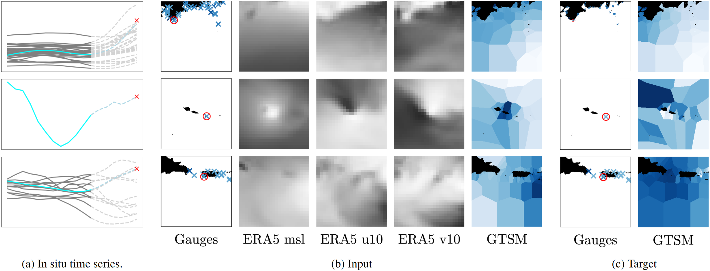
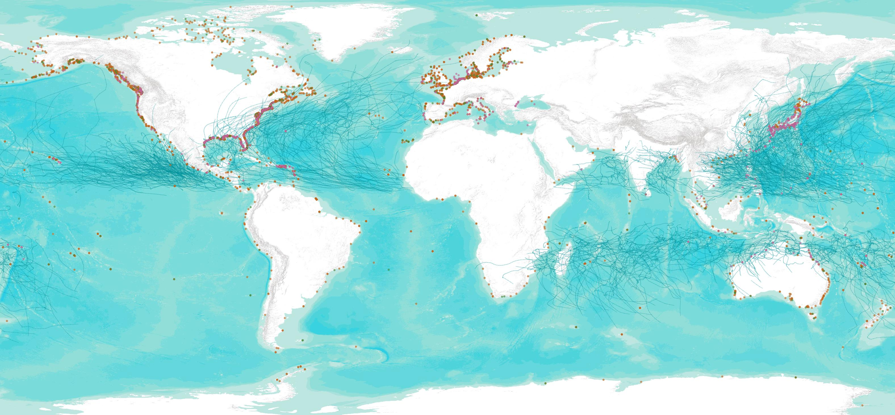
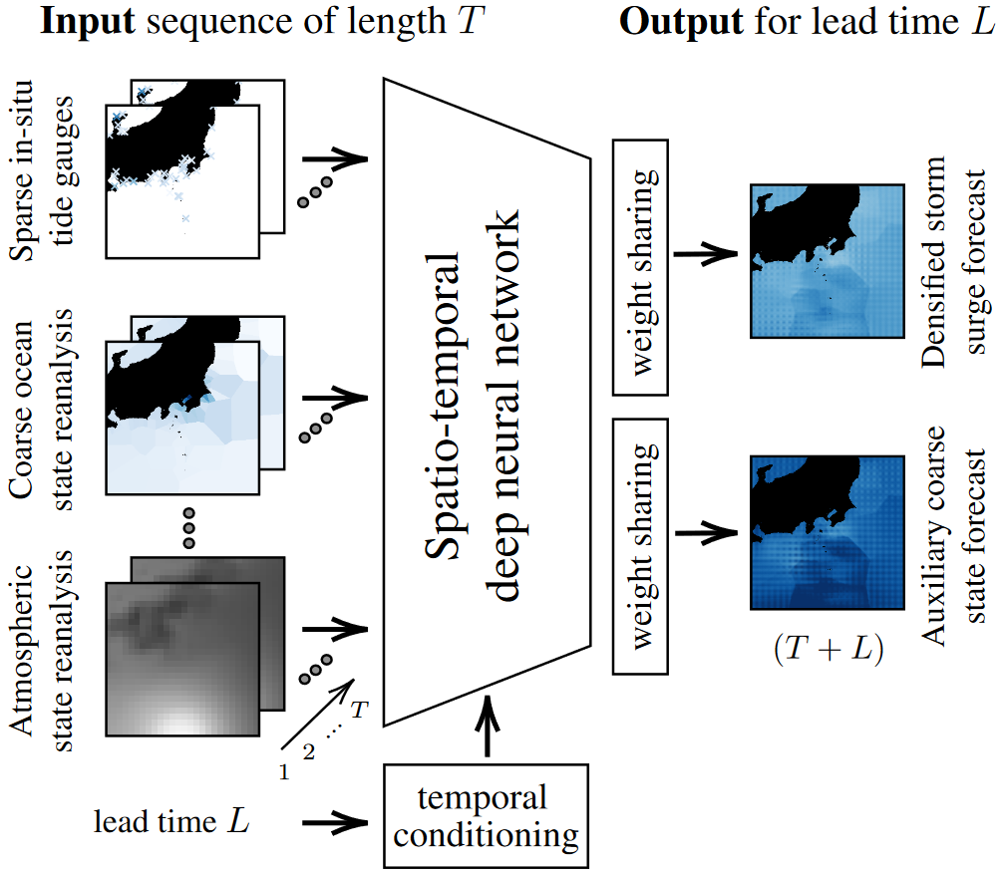

# Implicit Assimilation of Sparse In Situ Data for Dense & Global Storm Surge Forecasting


>
> _This is the official repository for the storm surge forecasting work of Ebel et al (2024), featuring the curation of a global and multi-decadal dataset of extreme weather induced storm surges as well as the implementation of neural networks for addressing the associated forecasting task. The provided dataset is multi-modal and features preprocessed in-situ tide gauge records as well as atmospheric reanalysis products and ocean state simulations. 
> The models applied in this work learn to fuse the sparse yet accurate in-situ measurements with the global ocean and atmosphere state products. This way, more accurate storm surge forecasts are achieved, with predictions broadcasted to sites missing well-maintained tidal gauge infrastructure._
---
This repository contains code accompanying the paper
> P. Ebel, B. Victor, P. Naylor, G. Meoni, F. Serva, R. Schneider Implicit Assimilation of Sparse In Situ Data for Dense & Global Storm Surge Forecasting. Proceedings of the IEEE Conference on Computer Vision and Pattern Recognition Workshops, 2024.

For additional information:

* The publication is available in the proceedings https://openaccess.thecvf.com/content/CVPR2024W/EarthVision/html/Ebel_Implicit_Assimilation_of_Sparse_In_Situ_Data_for_Dense__CVPRW_2024_paper.html
* For any further questions, please reach out to me here or via the credentials on my [website](https://pwjebel.com).
---



## Installation

#### Code

Clone the repository and change into the created folder:
```
git clone https://github.com/PatrickESA/StormSurgeCastNet.git
cd StormSurgeCastNet
```

Set up a conda environment as follows:	
```
conda env create -p envs/surgecast --file environment.yml 
conda activate envs/surgecast
 ```

The code is written in Python 3 and uses PyTorch 2.0. It is strongly recommended to run the code with CUDA and GPU support. The code has been developed and deployed in Ubuntu 20 LTS and should be able to run in any comparable OS.

#### Data

Create an account on the [Copernicus CDS](https://cds.climate.copernicus.eu/#!/home) platform and install the [API](https://cds.climate.copernicus.eu/how-to-api) for data access. Download (parts of) the needed data
```
python ./util/download_data.py
 ```
This contains data from Copernicus CDS as well as from the publication's acccompanying [Zenodo](https://zenodo.org/records/12067776) repository. Subsequently place all data into a desired directory `$DATADIR`, which you can later point all scripts towards via the flag `--root $DATADIR`.

---

<p align="center"></p>

## Usage

You can train a new model via

```
python train.py --experiment_name myFirstRun --root $DATADIR --weight_folder ./results --model utae 
```

and you can test a (pre-)trained model via

```
python test.py --experiment_name myFirstRun --root $DATADIR --weight_folder ./results
```

For a list and description of other useful flags (e.g. `--hyperlocal`, `--input_t`, `--lead_time`), please see the parser file [./parse_args.py](https://github.com/PatrickESA/StormSurgeCastNet/blob/main/parse_args.py). You can find pre-trained models [here](https://drive.google.com/drive/folders/149oGPROey-8u3TkLksnGBn7BZYypMi1J?usp=sharing).

---

## References

If you use this code, our models or data set for your research, please cite [this](https://openaccess.thecvf.com/content/CVPR2024W/EarthVision/html/Ebel_Implicit_Assimilation_of_Sparse_In_Situ_Data_for_Dense__CVPRW_2024_paper.html) publication:
```bibtex
@inproceedings{StormSurgeCastNet,
        title = {{Implicit Assimilation of Sparse In Situ Data for Dense & Global Storm Surge Forecasting}},
        author = {Ebel, Patrick and Victor, Brandon and Naylor, Peter and Meoni, Gabriele and Serva, Federico and Schneider, Rochelle},
        booktitle = {Proceedings of the IEEE Conference on Computer Vision and Pattern Recognition Workshops},
        year = {2024},
        organization = {IEEE},
        url = {"https://openaccess.thecvf.com/content/CVPR2024W/EarthVision/html/Ebel_Implicit_Assimilation_of_Sparse_In_Situ_Data_for_Dense__CVPRW_2024_paper.html"}
} 
```

## Credits

This code was originally based on the [UTAE](https://github.com/VSainteuf/utae-paps), the [UnCRtainTS](https://github.com/PatrickTUM/UnCRtainTS) and the [re-implemented MetNet3](https://github.com/lucidrains/metnet3-pytorch) repositories. Thanks for making your code publicly available! We hope this repository will equally contribute to the development of future exciting work.
