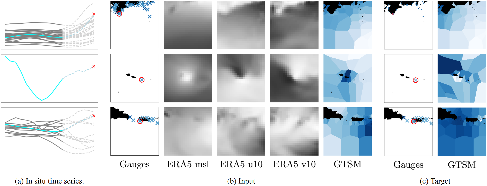
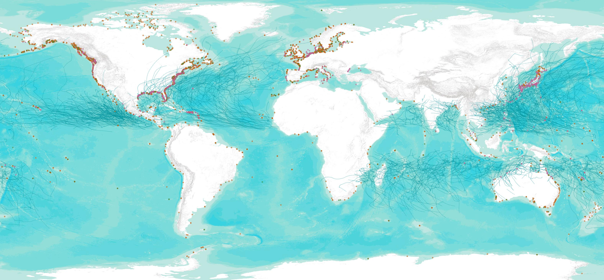
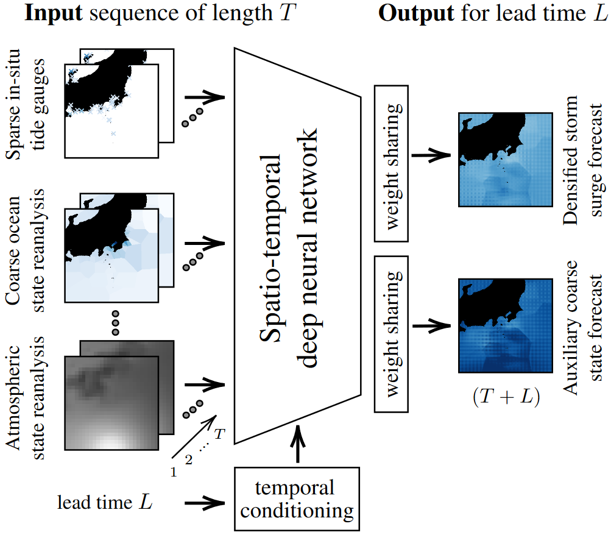

# Implicit Assimilation of Sparse In Situ Data for Dense & Global Storm Surge Forecasting


>
> _This is the official repository for the storm surge forecasting work of Ebel et al (2024), featuring the curation of a global and multi-decadal dataset of extreme weather induced storm surges as well as the implementation of neural networks for addressing the associated forecasting task. The provided dataset is multi-modal and features preprocessed in-situ tide gauge records as well as atmospheric reanalysis products and ocean state simulations. 
> The models applied in this work learn to fuse the sparse yet accurate in-situ measurements with the global ocean and atmosphere state products. This way, more accurate storm surge forecasts are achieved, with predictions broadcasted to sites missing well-maintained tidal gauge infrastructure._
---
This repository contains code accompanying the paper
> P. Ebel, B. Victor, P. Naylor, G. Meoni, F. Serva, R. Schneider Implicit Assimilation of Sparse In Situ Data for Dense & Global Storm Surge Forecasting. Proceedings of the IEEE Conference on Computer Vision and Pattern Recognition Workshops, 2024.

For additional information:

* The publication is available as a preprint on arXiv https://arxiv.org/abs/2404.05758
* For any further questions, please reach out to me here or via the credentials on my [website](https://pwjebel.com).
---



## Installation

**TBA, we'll address this as soon as possible!**

---

<p align="center"></p>

## Usage

**TBA, we'll address this as soon as possible!**

---

## References

If you use this code, our models or data set for your research, please cite [this](https://arxiv.org/abs/2404.05758) publication:
```bibtex
@inproceedings{StormSurgeCastNet,
        title = {{Implicit Assimilation of Sparse In Situ Data for Dense & Global Storm Surge Forecasting}},
        author = {Ebel, Patrick and Victor, Brandon and Naylor, Peter and Meoni, Gabriele and Serva, Federico and Schneider, Rochelle},
        booktitle = {Proceedings of the IEEE Conference on Computer Vision and Pattern Recognition Workshops},
        year = {2024},
        organization = {IEEE},
        url = {"https://arxiv.org/abs/2404.05758"}
} 
```

## Credits

This code was originally based on the [UTAE](https://github.com/VSainteuf/utae-paps), the [UnCRtainTS](https://github.com/PatrickTUM/UnCRtainTS) and the [re-implemented MetNet3](https://github.com/lucidrains/metnet3-pytorch) repositories. Thanks for making your code publicly available! We hope this repository will equally contribute to the development of future exciting work.
